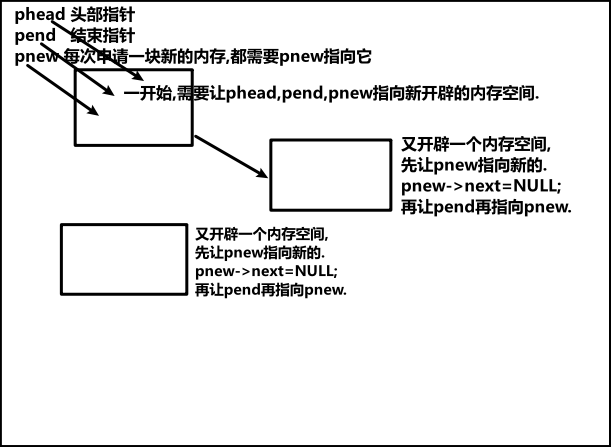

##### 计算机语言

 ```c
  计算机语言{Computer language}指用于人与计算机之间通讯的语言
  为了使电子计算机进行各种工作,就需要有一套用以编写计算机程序的数字、字符和语法规则.
  由这些字符和语法规则组成计算机各种指令,这些就是计算机能接受的语言.
  - 第一代计算机语言
    & 机器语言  
  - 第二代计算机语言
    & 汇编语言
  - 第三代计算机语言
    & 高级语言:(面向过程)C、Fortran、Basic、pascal...
    & 高级语言:(面向对象)C++、Java、Python、C#...
 ```

##### 解释性语言

 ```c
  解释性语言编写的程序不进行预先编译
  以文本方式存储程序代码，执行时才翻译执行，程序每执行一次就要翻译一次.
  - 跨平台能力强
  - 易于调试
  - 执行速度慢
 ```

##### 编译性语言

 ```c
  编译性语言在执行之前要经过编译过程,编译成一个可执行的机器语言的文件{二进制}比如exe.
  因为翻译只做一遍,以后都不需要翻译,所以执行效率高.
  - 执行效率高
  - 跨平台能力弱
  - 不便于调试
 ```

##### Hello world

```c
一般情况下,C语言程序是从main()开始执行.从左花括号'{'到右花括号'}'结束.
默认情况下,C语言程序自上而下的顺序执行.执行的基本单位是语句,每条语句用分号;隔开.
#include<stdio.h>   //用于声明需要使用的头文件
int main(){
    printf("%s\n","hello world!"); //hello world!
    printf("%s=%d\n","1+1",1+1); } //1+1=2
```

##### 变量和常量

```c
变量规则:
1.不能以数字开头 2.不能特殊符号开头{但_可以} 3.不能以关键字(标识符)开头{int}
#include<stdio.h>
int main() {
	int price = 0; //初始化:定义变量a  [这里0是常量  price是变量]
	price = 20;    //再次赋值		  [这里20是常量  price是变量]
	printf("总金额为:%d",10+price);} 
>>>总金额为:30
```

##### C语言格式字符

```c
C语言中的格式占位符：//没有专门的2进制格式占位符
%d 读入十进制整数
%i 读入十进制,八进制,十六进制整数
%f-单精度浮点 %lf双精度浮点数
%p-指针
%a/%A 读入一个浮点值(仅C99有效)
%c-读入一个字符  %s-读入一个字符串，遇空格、制表符或换行符结束
%o-读入八进制整数
%x/%X 读入十六进制整数
%e-科学计数
%g-小数或科学计数 
%p 读入一个指针
%u 读入一个无符号十进制整数
%n 至此已读入值的等价字符数
%[] 扫描字符集合
%% 读%符号
```

##### C语言数据类型

 

##### 整型

| 关键字         | 字节        | 数值范围                  |
| -------------- | ----------- | ------------------------- |
| short          | 2字节       | -32768 ~ 32767            |
| int            | 4字节       | -2147483648 —— 2147483647 |
| long           | 4字节/8字节 | -2147483648 ~ 2147483647  |
| unsigned short | 2字节       | 0 ~ 65535                 |
| unsigned int   | 4字节       | 0 ~ 4294967295            |
| unsigned long  | 4字节/8字节 | 0 ~ 4294967295            |

```c
#include<stdio.h>
#include <limits.h>
int main() {
 printf("short的范围为:%hd ~ %hd,字节长度为%d\n", SHRT_MIN,SHRT_MAX,sizeof(short));
 printf("int的范围为:%d ~ %d,字节长度为%d\n", INT_MIN, INT_MAX, sizeof(int));
 printf("long的范围为:%ld ~ %ld,字节长度为%d\n", LONG_MIN, LONG_MAX, sizeof(long));
 printf("char的范围为:%d ~ %d,字节长度为%d\n", CHAR_MIN, CHAR_MAX, sizeof(char));
 printf("unsigned short的范围为:%hu ~ %hu,字节长度为%d\n", 0, USHRT_MAX,sizeof(unsigned short));
 printf("unsigned int的范围为:%u ~ %u,字节长度为%d\n", 0, UINT_MAX, sizeof(unsigned int));
 printf("unsigned long的范围为:%lu ~ %lu,字节长度为%d\n", 0, ULONG_MAX, sizeof(unsigned long));}
>>>short的范围为:-32768 ~ 32767,字节长度为2
>>>int的范围为:-2147483648 ~ 2147483647,字节长度为4
>>>long的范围为:-2147483648 ~ 2147483647,字节长度为4
>>>char的范围为:-128 ~ 127,字节长度为1
>>>unsigned short的范围为:0 ~ 65535,字节长度为2
>>>unsigned int的范围为:0 ~ 4294967295,字节长度为4
>>>unsigned long的范围为:0 ~ 4294967295,字节长度为4
    
1.long在Linux64环境下所占用字节位8,也就间接说明了long在macOS下的字节长度也是8.
  所以在写跨平台的应用时,如果使用到long型,需要考虑到精度丢失的问题,在写跨平台应用时也尽量避免使用long型.
2.long在赋值,后面一般加L/l. 比如long sum = 100L;  表示100L是一个长整型的常量   
```

##### 浮点型{实型}

| 关键字             | 字节  | 数值范围                           |
| ------------------ | ----- | ---------------------------------- |
| float单精度浮点数  | 4字节 | 3.4x10的-38次方 ~ 3.4x10的38次方   |
| double双精度浮点数 | 8字节 | 1.7x10的-308次方 ~ 1.7x10的308次方 |

```c
浮点数输出的特性
printf("%lf",10.0/3);  //3.333333
printf("%lf",10/3);   //0.000000
double sum = 10/3;
printf("%lf",sum);//3.000000
定义浮点数,后面加f.    float totalPrice = 0.5f;
```

##### 字符型数据

```c
char a = 'k'; //单引号里面只能放一个字符
printf("%c", a);
printf("%d", a);//以ASCII码输出
>>>k
>>>107
char a ='我';  //一个汉字是占2个字节,所以不能用char显示单个汉字.
char a ="k";  //带双引号其实占2个字节{k和\0}
```

| 关键字        | 字节  | 数值范围   |
| ------------- | ----- | ---------- |
| unsigned char | 1字节 | 0 ~ 255    |
| signed char   | 1字节 | -128 ~ 127 |

##### 布尔类型

```c
布尔类型:true{真=1} false{假=0}   
{c89没有布尔类型,c99增加了布尔类型 但是需要引入头文件#include<stdbool.h>}
bool a = true;
printf("%d,"a);
>>>1
```

##### 运算符

```c
算术运算符将运算对象(也称操作数)连接起来的、符合C语法规则的式子，构建成算术表达式.
运算对象包括常量、变量、函数等
运算符的分类:
- 双目运算符:参加运算的操作数有2个
   a + b
- 单目运算符:参加运算的操作数只有1个
   a++
- 三目运算符:参加运算的操作数有3个
  int x = a>b?10:20      
```

##### 算数运算符

```c
+{加}、-{减}、*{乘}、/{除}、%{取余}
+={先加在赋值}、-={先减在赋值}、*={先乘在赋值}、/={先除在赋值}、%={先取余在赋值}
a=a+1;  =  a+=1;

//1000分钟等于多少小时多少分钟？
int time = 1000;
int hours = time / 60;
int minutes = time % 60;
printf("%d分钟等于%d小时%d分钟",time,hours,minutes);
>>>1000分钟等于16小时40分钟
```

##### 比较运算符

```c
>、<、==、>=、<=、!=

int a = 28;
printf("结果是%d",a>30); //比较结果为真:1  假:0
>>>结果是0
printf("结果是%d",a>27); //比较结果为真:1  假:0
>>>结果是1
```

##### 逻辑运算符

```c
&&{与}、||{或}、 !{非}
printf("%d\n",1<2 && 3>4);//&&同真为真,一假则假 >>>0
printf("%d\n",2>1 || 1>2);//||一真为真,同假则假 >>>1
printf("%d\n",!(2>1));    //!非{1非为0,0非为1} >>>0

//写除了周六周天,且商品为家电,金额大于200才能打7折.
int price = 250;//总金额
int type = 1; //0代表食品  1家电  2衣服
int day = 1; //星期x
if (price > 200 && type == 1 && !(day==6 || day==7)) {
    price *= 0.7;
    printf("%d",price);			>>>175				 }
```

##### 逻辑与算符'与'的小技巧  {左真&&右边就会执行}

 

##### 三目运算符

```c
语法:条件 ? 条件为true的时候执行 : 条件为false的时候执行
//如果价格大于200打7折
    //if写法
	int sum = 250;
	if (sum > 200) {printf("%.2f\n",sum*0.7);}
	//三目运算符
	sum > 200 ? printf("%.2f\n", sum * 0.7) : printf("不打折");
	//三目运运算符 赋值写法
    sum = sum>200 ? sum*0.7 :sum;
```

##### 逗号运算符

```c
逗号运算符的结果是后边表达式的结果.从左到右运算.
	int a = (100,200);printf("%d",a);  // >>>200

//定义一个变量a=1,先让它加2,再平方.结果要求为9
int a = 1;
a=(a+2)*a;  //输出为3,因为这一行右边的表达式a同时为1.
这是可以用 逗号运算符
a = (a=a+2,a*a);  //输出为9,逗号左边表达式先运算的结果 赋值 给逗号右边表达式.
// 逗号运算符(,,,)的逗号可以>=1{无数个}
```

##### 自增自减运算符

```c
++{自增}
进行自增运算,分为两种:前置++和后置++
前置++a:先把值自动+1,在返回.  后置a++:先把值返回,在自动+1
--{自减}
进行自减运算,分为两种:前置--和后置--
前置--:先把值自动-1,在返回.  后置--:先把值返回,在自动-1.
int a = 1;
a++; printf("%d",a); >>>2
--------------------------------------------------------
int b = 1; int result=0;
result =10 + b++; printf("%d",result);//后置:先赋值再自增
>>>11
result = 10 + ++b; printf("%d",result);//前置:先加1再赋值.    
>>>12
int n=10; int sum = n++ + n++ + n++; >>>sum=10+10+10=30
int n=10; int sum = ++n + ++n + ++n; >>>sum=13+13+13=39   
```

##### 运算符的优先级

```c
C语言表达式中按照优先级先后进行运算:优先级高的先于优先级低的先运算.
优先级一样的按结合性来运算.
 - 左结合性:从左向右运算
sum = x + y + z;  {1+2+3= 3+3=6}
 - 右结合性:从右向左运算
a = b = c = d = 100;
a += b += c += d += 100;  //运算符级别14 自右向左
printf("%d %d %d %d", a, b, c, d);>>> 500 400 300 200
```

 

 

##### if分支结构

```c
- 我们的C代码都是顺序执行的(从上到下)
- 逻辑分支就是根据我们设定好的条件来决定要不要执行某些代码
 - 1.if语句:通过一个 if语句来决定代码是否执行
if(条件){条件为True走的程序}
 - 2.if else 语句:通过if else语句可以执行条件真和者条件假的程序
if(条件){条件为True走的程序}else{条件为False走的程序}
 - 3.if ... else if 语句
if (条件1){条件1为 true 的时候执行}else if(条件2){条件2为true的时候执行}
 - 4.if ...else if... else 语句
和之前的if else if一致,只不过是在所有条件都不满足的时候,执行最后else后面的{}
```

##### if案例

 

```c
VS的SDL选项是编译器在源代码层次,尽最大可能减少安全漏洞的数量和严重性.
scanf这样的函数,在目前看来就是不安全的,可能会溢出导致程序崩溃.
//案例1:判断奇数和偶数(能被2整除就是偶数,否则奇数)三种方式
scanf_s("%d",&num);
1.if(num%2==0){printf("偶数");}else {printf("奇数");}
2.if(num%2){printf("奇数");}else{printf("偶数");}
3.if(!(num%2)){printf("偶数");}else {printf("奇数");}
//案例2:根据0~100的数字输出成绩
if (num >= 90){printf("A");}
else if (num >= 80){printf("B");}
else if (num >= 70){printf("C");}
else if (num >= 60){printf("D");}
else { "成绩不合格"; }
//案例3:判断闰年
//世纪闰年:年份是整百数的,且是400的倍数.比如2000,4000年
//普通闰年:年份是4的倍数,且不是100的倍数.比如2020年 
printf("请输入一个年份:\n");
int year = 0;    scanf_s("%d",&year);
if (year %400==0||(year%4==0)&&(year%100!=0)) 
{printf("闰年366天");}
else{ printf("平年365天"); }
```

##### Switch条件分支结构

```c
swtich也是条件判断语句的一种:是对于某一个变量的判断
switch (要判断的变量) {
  case 情况1:     //case只能放常量
    情况1要执行的代码
    break        //符合条件,退出switch
  case 情况2:
    情况2要执行的代码
    break
  default:
    //上述情况都不满足的时候执行的代码       
}
//判断1-12月哪些是31天哪些是30天
	switch (month) {
	case 1:case 3:case 5:case 7:
	case 8:case 10:case 12:
		printf("这个月有31天");
		break;
	case 2:
		printf("这个月有28天");
		break;
	case 4:	case 6: case 9:case 11:
		printf("这个月有30天");
		break;
	default:
		printf("这不是1-12月的范围内");}
```

##### while循环

```c
- while 中文叫 当...时，其实就是当条件满足时就执行代码,一旦不满足了就不执行.
- 语法 while (条件) { 满足条件就执行 }
//求1~100和
int sum =0; int n = 0;
while(n<=100){sum=sum+n;n++;}
printf("%d",sum);
//输入一个数,算它的阶乘 {阶乘:3!=3x2x1=6}
int n = 0;int sum =1;
scanf_s("%d",&n);
while (n >= 1) { sum = sum * n; n--; }
printf("%d", sum);
```

##### do-while循环

```c
- 是一个和 while 循环类似的循环
- while会先进行条件判断,满足就执行,不满足直接就不执行了
- 但是 do while循环是,先不管条件,先执行一回,然后在开始进行条件判断
- 语法： do { 要执行的代码 } while (条件)
int n = 1;
do { printf("%d",n); } while (n>1);///>>>1  先执行再判断
///求1~100和
int sum = 0;int n = 0;
do {sum += n;n++;}
while (n <= 100);printf("%d", sum);
```

##### for循环

```c
和while和do While循环都不一样的一种循环结构.道理是和其他两种一样的,都是循环执行代码的.
语法:
for (int i = 0; i < 10; i++) {// 把初始化，条件判断，自身改变，写在了一起
   这里写的是要执行的代码,执行完代码再i++ }
- for里面定义的i,在for循环外面是无法使用的.
- i可以调整步长: 例:i++可换成i+=2、i=i+5
//求1~100和
int sum = 0;
for (int i = 0; i <= 100; i++){sum = sum + i;}
printf("%d",sum); //>>>5050
//输出1000-2000所有的闰年
int count =0;
for (int i = 1000; i <= 2000; i++) {
  if (i%400==0||i%4==0&&i%100!=0) {
	printf("%d ", i);
	count++;
	if (count%4==0) { printf("\n"); }}}//每四个换一行
```

##### break 终止循环

```c
- 在循环没有完成的时候,因为我设置的条件满足,提前终止循环
- 要终止循环,就可以直接使用break关键字.
for (int i = 1; i <= 5; i++) {
    // 当i的值为3时,条件为 true,执行 {} 里面的代码终止循环
    // 循环就不会继续向下执行了，也就没有4和5了
    if (i == 3) {break;}
    printf("%d", i);         }
```

**Continue结束本次循环**

```C
- 在循环中,把循环的本次跳过去,继续执行后续的循环
- 跳过本次循环,就可以使用continue关键字
for (int i = 1; i <= 5; i++) {
//当 i 的值为 3 的时候,执行 {} 里面的代码
// {} 里面有 continue,那么本次循环后面的代码就都不执行了
// 自动算作 i 为 3 的这一次结束了，去继续执行 i = 4 的那次循环了
  if (i == 3) {continue;}
   printf("%d", i);		     }		
```

##### 判断质数

```c
质数又叫素数,指的是在大于1的自然数中,除了1和它本身以外不再有其他因数的自然数.反之则被称为合数.
1和0既非素数，也非合数.
int sum = 0;printf("请输入数字\n");
scanf("%d", &sum);int isPrime = true;
for (int i = 2; i < sum; i++) {
	if (sum % i == 0) {
	isPrime = false;//false不是质数,True是质数.}	
	break;//已经被整除说明是质数,跳出循环,不需要继续往下判断}
	if (isPrime) {printf("%d是质数", sum);}
    else {printf("%d不是质数", sum);}
```

##### 九九乘法口诀表

```c
// for循环 
for (int j = 1; j <= 9; j++) {
    for (int k = 1; k <= j; k++) {
        printf("%dx%d=%d  ", k, j, j * k);}
    printf("\n");
}
//while循环
int j = 1;int k = 1;
while (j <= 9)  {
    k = 1;
    while (k <= j) {
        printf("%d*%d=%d ", k, j, k * j);
        k++;}
    j++;
    printf("\n"); }           
```

##### 函数

```c
将常用的整体实现某个功能的代码块封装起来,用到的时候可以直接调用.
- 函数可以比喻为把任意一段代码放在一个盒子里面
- 在我想要让这段代码执行的时候,直接执行这个盒子里面的代码就行
hello_printf() {//定义一个函数
	printf("************\n");
	printf("hello world!\n");
	printf("************\n");}
int main() {hello_printf(); //调用函数}
 - 函数内部的变量,函数外部是无法访问的.
```

##### 函数的参数

```c
- 我们在定义函数和调用函数的时候都出现过 ()
- 就是用来放参数的位置
- 参数分为两种 形参和 实参
- 函数的参数可以定义多个
void fn(行参写在这里) {//定义函数
   一段代码		     }
fn(实参写在这里)  //调用函数
    
形参
- 就是在函数内部可以使用的变量,在函数外部不能使用
- 每写一个变量,就相当于在函数内部定义了一个可以使用的变量(遵循变量名的命名规则和命名规范)
- 多个单词之间以,分隔
实参
- 在函数调用的时候给行参赋值的
- 也就是说,在调用的时候是给一个实际的内容的
- 函数内部的行参的值,由函数调用的时候传递的实参决定
- 多个参数的时候，是按照顺序一一对应的
    
sum_4(int x,int y,int z) {
	int sum = x + y + z;
	printf("%d",sum);  }
int main(){sum_4(1, 2, 3);}//实现了3个数相加的功能函数
```

##### 函数的return

```c
return是返回的意思,其实就是给函数一个返回值和终断函数.
- 若是无返回值,则在函数名前加void. void printf_hello(){...}
- 函数调用本身也是一个表达式,表达式就应该有一个值出现
- return 关键字就是可以给函数执行完毕一个结果
  int fn() {
    // 执行代码
    return 100 }
  // 此时，fn() 这个表达式执行完毕之后就有结果出现了
- 我们可以在函数内部使用 return 关键把任何内容当作这个函数运行后的结果
    
int primeJudge(int number) {//判断是不是质数的函数
	bool Judge = true;
	for (int i = 2; i < number; i++) {
		if (number % i == 0) {
			Judge = false;//不是质数
			break;           }}
	if (Judge == false) { return false; }
	else { return true; }    } //返回false或者true

int main() {
	for (int i = 2; i < 200;i++) {
		if (primeJudge(i)) {
			printf("%d是质数\n",i);}}}
```

 **终断函数**

```c
- 当我开始执行函数以后,函数内部的代码就会从上到下的依次执行
- 必须要等到函数内的代码执行完毕
- 而 return关键字就是可以在函数中间的位置停掉,让后面的代码不在继续执行
void fn() {
    printf("11");
    return; //后面不会执行了
    printf("33");}
// 函数调用
fn()    >>> 11
```

##### 函数的声明

```c
有些情况下,如果不对函数进行声明,编译器在编译的时候,可能不认识这个函数.
有可能把定义函数放在了main下面,因为编译器在编译C程序的时候,从上往下编译的.

- 直接声明法
void func(void);//声明
int main()
{  func();           }
void func(void){ //定义
printf("hello world\n");}

- 间接声明法
创建一个新的.h头文件,将函数的声明放在头文件中.c程序引入头文件即可.
//test.c
void func(void){printf("hello world\n");}
//test.h
void func(void);
//main.c
#include"test.h"  //即可调用test.c的func函数.
或者 extern void printf_hello();

使用函数的好处? 
1.定义一次,可以多次调用,减少代码的冗余度. 
2.使咱们代码,模块化更好,方便调试程序,而且阅读方便.
```

##### 内存分区

```c
1.内存:物理内存、虚拟内存
- 物理内存:实实在在存在的存储设备
- 虚拟内存:操作系统虚拟出来的内存
- 操作系统会在物理内存和虚拟内存之间做映射.
- 在写应用程序的,咱们看到的都是虚拟地址.
    
2.在运行程序的时候,操作系统会将虚拟内存进行分区.
- 堆:{在动态申请内存的时候,在堆里开辟内存.}
- 栈:{主要存放局部变量、函数调用、函数形参}
- 静态全局区:
  1:未初始化的静态全局区
  静态变量(定义变量的时候,前面加static修饰)或全局变量,没有初始化的存在此区.
  2:初始化的静态全局区
  全局变量、静态变量,赋过初值的,存放在此区
- 代码区:{存放咱们的程序代码}
- 文字常量区:{存放常量的}
```

##### 普通全局变量

```c
在函数外部定义的变量.
定义普通的全局变量的时候,如果不赋初值,它的值默认为0.
int number=100;//number 就是一个全局变量
int main()//main函数
{return 0;}
作用范围:
- 普通全局变量的作用范围在1.c全部范围内使用.
- 如果2.c需要用到1.c的全局变量,那么需要声明.声明方法extern int number;
- 注意声明的时候,不要赋值.
生命周期:
- 程序运行的整个过程,一直存在,直到程序结束.
```

##### 静态全局变量

```c
定义静态全局变量的时候,前面用static修饰.
- 只能在定义它的.c(源文件)中有效.{包括定义它的c文件的所有函数}
- 在程序的整个运行过程中,一直存在.
- 定义静态全局变量的时候，如果不赋初值,它的值默认为0.
static int number=100;//number 就是一个静态全局变量
```

##### 普通局部变量

```c
在函数内部定义的,或者复合语句(if/for)中定义的变量.
作用范围:
- 在函数中定义的变量,在它的函数中有效
- 在复合语句中定义的,在它的复合语句中有效
int main()
{  int num;//函数内部普通局部变量
   if(1){int a;} //复合语句普通局部变量 
}
```

##### 静态局部变量

 ```c
 定义静态局部变量的时候,前面加static修饰.
 作用范围： 
  - 在它定义的函数或复合语句中有效
  - 第一次调用函数的时候,开辟空间赋值,函数结束后,不释放.
    以后再调用函数的时候.就不再为其开辟空间,也不赋初值,用的是以前的那个变量.
 ```

#####  变量重名

```C
如果一个c文件有全局变量a,在c文件的main函数也有局部变量a.
int a = 1;
int main() {
	int a = 2;
	printf("%d",a);}  >>>2
就近原则:局部变量>全局变量
```

##### 静态函数{内部函数}

```c
在定义函数的时候,返回值类型前面加static修饰,这样的函数被称为静态函数.
static限定了函数的作用范围,在定义的.c中有效.{外部.c声明了也不可调用}
```

##### 数组

```c
数组是若干个相同类型的变量在内存中有序存储的集合.
int a[5];//定义了一个整型的数组a
数组的名字是a,数组中有5个元素,每个元素的类型都是int类型，而且在内存中连续存储.
这五个元素分别是 a[0] a[1] a[2] a[3] a[4]
- 初始值过多不行 比如int a[2]={1,2,3}会错误
- 少可以,默认值为0 比如 int a[2]={1} 那么a[1]=为0.
```

##### 数组的遍历

```c
int weight[] = {10,22,33,44,55};
for (int i = 0; i<sizeof(weight)/sizeof(int);i++) {
printf("第%d天的体重为%d\n", i + 1,weight[i]);}
>>>第1天的体重为10
>>>第2天的体重为22 
>>>第3天的体重为33
>>>第4天的体重为44
>>>第5天的体重为55
sizeof(weight)/sizeof(int) 数组的总字节/int类型的字节长度=数组内变量的个数
```

##### 数组的分类

```c
1.字符数组
char name1[]={"zhong"};
//数组name1 存了'z','h','o','n','g','\0'.
char name2[]={'z','h','o','n','g'};
//数组name2 存了'z','h','o','n','g'.与name1不同.
2.短整型的数组
short  a[10]; 
3.整型的数组
int a[10]; 
4.长整型的数组
lont a[5];
5.浮点型的数组（单、双）
float a[6]; a[4]=3.14f;
double a[8]; a[7]=3.115926;
6.指针数组
char *a[10]
7.结构体数组
struct student a[10];
```

#####  二维数组

 

```c
二维数组:用一个变量存储更多信息.
数组名[行下标][列下标]
二维数组在省略的时候只能省略行数,不能省略列数.
int grades[][3]={{98,99,100},{100,99},{87,88,78}};
printf("%d\n",grades[0][2]);  >>>100
printf("%d\n", grades[1][2]); >>> 0 //没有写数据,自动赋值0
//遍历二维数组每一行的第一个数据
for (int i = 0; i < sizeof(grades)/(sizeof(int)*3);i++) {
 printf("%d\n", grades[i][0]);}>>> 98 100 87 打印每一行的第一列(个)
//遍历二维数组全部数据 
for (int i = 0; i < sizeof(grades)/(sizeof(int)*3);i++) {
    printf("第%d行:",i);
    for(int j = 0;j<3;j++){printf("%d ", grades[i][j]);}       
    printf("\n");}
>>>第0行:98 99 100
>>>第1行:100 99 0
>>>第2行:87 88 78
    
char str[][100] = {"zhong","xiaoming","xiaoli","诸葛亮"};
printf("%c\n", str[0][1]);//h
printf("%c\n", str[1][0]);//x
printf("%s\n", str[1]);//xiaoming
printf("%s\n", str[3]);//诸葛亮
//遍历
for (int i = 0; i < sizeof(str) / (sizeof(char) * 100); i++) {
    printf("%s ", str[i]);}
>>>zhong xiaoming xiaoli 诸葛亮
```

#####  数组排序{就是把一个乱序的数组.通过我们的处理.让他变成一个有序的数组.}

```c
冒泡排序:    
- 先遍历数组,让挨着的两个进行比较,如果前一个比后一个大,那么就把两个换个位置
- 数组遍历一遍以后,那么最后一个数字就是最大的那个了
- 然后进行第二遍的遍历,还是按照之前的规则,第二大的数字就会跑到倒数第二的位置
- 以此类推,最后就会按照顺序把数组排好了
//交换位置{将44和11交换}
int arr[] = {44,11,33,2,5,3,1};
int temp = arr[0];//通过临时变量存一下,再交换
arr[0] = arr[1];arr[1] = temp;
printf("%d %d",arr[0],arr[1]);}   
//冒泡排序数组
int arr[] = {44,11,33,2,1,3};
for (int i = 0; i < sizeof(arr) / sizeof(int)-1; i++) {
这里为什么要-1呢?因为数组就只有6个数,不减1的情况下,当i=5,arr[5]>arr[6]时,
arr[6]是没有数据的.因为数组是从0开始数起的.所以需要sizeof(arr)/sizeof(int)-1
	if (arr[i]>arr[i+1]) {
		int temp = arr[i];
		arr[i] = arr[i + 1];
		arr[i + 1] = temp;}	} 
for(int i=0;i<sizeof(arr)/sizeof(int); i++){ printf("%d ", arr[i]);}
>>> 11 33 2 1 3 44  //这样44就到最后面去了.
这样经过5次for循环,就完全排序好了,但5次循环浪费资源,所以可以用循环嵌套一步到位.
for (int i = 0; i < sizeof(arr) / sizeof(int)-1; i++) {
 for (int j = 0; j < sizeof(arr) / sizeof(int) - 1-i; j++){
	if (arr[j] > arr[j + 1]) {
      int temp = arr[j];  arr[j] = arr[j + 1];  arr[j + 1] = temp;}}}      
for(int i =0;i < sizeof(arr)/sizeof(int);i++){ printf("%d ", arr[i]);}  
>>>1 2 3 11 33 44    
```

##### 选择排序法

```C
选择排序法:
- 先假定数组中的第0个就是最小的数字的索引
- 然后遍历数组，只要有一个数字比我小,那么就替换之前记录的索引
- 直到数组遍历结束后,就能找到最小的那个索引,然后让最小的索引换到第0个的位置
- 再来第二趟遍历,假定第1个是最小的数字的索引
- 在遍历一次数组,找到比我小的那个数字的索引
- 遍历结束后换个位置
- 依次类推,也可以把数组排序好
    
int arr[] = {44,11,33,2,1,3};
//假设索引0位置的数值最小
int index = 0;
for (int i=1;i<sizeof(arr)/sizeof(int);i++) {
  if (arr[i] < arr[index]) {//数组每一个索引跟第0个索引对比
  index = i; //如果比索引0小就把小的值的索引赋值给index.跟新的索引index比较
}}//做完循环后,找到了最小的值的索引index
int temp = arr[0]; //44存入temp
arr[0] = arr[index]; //找到的最小值,让它去索引0.
arr[index] = temp;  //44再去原本最小值的索引
for(int i =0;i < sizeof(arr)/sizeof(int);i++){ printf("%d ", arr[i]);}
>>>1 11 33 2 44 3   //这样最小的值就到最前面了 
然后继续假设索引1位置的数值最小,因为索引0已经算出是最小了,从1开始即可.
int index = 1;
for (int i=1;i<sizeof(arr)/sizeof(int);i++) {同上...}
找到规律后,我们继续使用循环嵌套.
for(int i=0;i<sizeof(arr)/sizeof(int);i++)
{   int dex = i;  
    for(int j=i+1;j<sizeof(arr)/sizeof(int);j++){
     if (arr[j] < arr[index]) { index = j;}     }
    int temp = arr[i]; //假设第一个最小的索引值存入temp
	arr[i] = arr[index]; //找到的最小值,让它去索引i.
	arr[index] = temp;  //假设最小的值再去原本最小值的索引  
} //使用循环嵌套,一次排好顺序
```

##### 取地址运算&

```c
scanf("%d",&i);里的&，&是C语言的一个运算符.
获得变量的地址,它的操作数必须是变量.(C语言的变量是放在内存里的)
比如说int占4个字节,在内存中要占据一定的地方,放在某个地方就有地址,
所以&运算符就是把变量的地址告诉你.指针就是地址.
//int取地址
int i = 0;
printf("%x\n", &i);//c3faf924//由于64架构,所以不相等.
printf("%p\n",&i);//000000F5C3FAF924
------------------------------------------------------------
int i = 0;int p;
p=(int)&i;
printf("%d\n",p);//fe6ffb84////由于64架构,所以不相等.
printf("%p\n",&i);//0000009DFE6FFB84
&可以给我们取出一个变量的地址,但是这个地址的大小,它的数据类型和int是否相等
取决于编译器、取决于是64位架构还是32位架构.
    
printf("d\n",sizeof(int)); >>>32位:4字节 64位:4字节
printf("%d\n",sizeof(&i));>>> 32位:4字节 64位:8字节
地址和整数并不是永远都是相同的,这和架构有关.
所以我们输出一个地址,是需用的是%p而不是当成整数.
//数组取地址
int a[10];
printf("%p\n",&a);  >>>000000F427CFFB08 
printf("%p\n",a);   >>>000000F427CFFB08
printf("%p\n",&a[0]);>>>000000E36F55FBB8
printf("%p\n", &a[1]);>>>000000E36F55FBBC
可以看出取地址&a=a=a[0],且相邻的数组单元之间地址差距永远是4.
int *a在32位平台下,地址总线是32位,所以地址是32位编号,所以指针变量是32位即4个字节.
而再64位平台下，是占8个字节的.
```

#####  指针

```c
如果能够将取得变量的地址传递给一个函数,能否通过这个地址在那个函数内访问到外面变量?
所以就需要用到指针.一个指针类型的变量,就是保存地址的变量.
就是保存那个&取地址符得到的变量的地址的变量.
 - 普通变量的值就是实际的值
 - 而指针变量的值具有实际值的变量的地址
int i;
int *p =&i; //表示p里面的值就是i变量的地址,这个时候就说p指向i.

int *p = int* p; //星号靠近int还是指针名都是一样的.
int* p,q; //这里p是指针,但是q不是.就是 int q.

当我们把一个指针作为参数的时候,void f(int *p);
当我们去调用这个函数的时候,我们就要交给它一个地址,而不能是变量本身和变量的值.
必须用&符号取得某个变量的地址,传给这个指针.
void f(int* p){
 printf("p=%p\n", p);}
int i = 6;
printf("&i=%p\n",&i);>>>&i = 000000AA1DEFF584
f(&i);               >>>p = 000000AA1DEFF584
main函数有个变量i=6,地址是x,然后把地址取出来交给了另外f函数的指针变量p
这个p的值也是x,所以p是指针指向了i,意味着在函数里面可以通过这个指针访问外面i变量.
如果你有一个地址,你想访问那个地址上的变量,就需要用到运算符 *
*是一个单目运算符,用来访问指针的值所表示的地址上的变量.
访问之后可以做左值也能做右值.
  - int k = *p;  //放右边读它的值
  - *p = k+1;    //放左边去写它的值
-------------------------------------------------      
void f(int* p)     {
	printf("p=%p\n", p);
	printf("*p=%d\n", *p);//读取值
	*p = 26; //改写值  }
int i = 6;
f(&i);  
>>>p=000000526C4FF994
>>>*p=6
printf("i=%d\n",i);
>>>i=26
----------------------------------------------------
void d(int d)(){d=1000;}
int main(){
    int a =0;
    d(a); printf("a=%d",a);}>>>这里输出还是0,和指针不一样.
-----------------------------------------------------
为什么int i;scanf("%d",i);少了&编译没有报错?
你把一个整数和你把一个地址传进去,对于scanf来说没看出区别,
scanf以为你传进去的i是i的地址,其他你传进去的是实际的值.
所以编译不会报错,但是运行一定会出错.
```

##### 指针训练

```C
- 将冒泡排序法的交换两个数的位置代码封装成函数
if (arr[j] > arr[j + 1])  {
  int temp = arr[j];  
  arr[j] = arr[j + 1]; 
  arr[j + 1] = temp;       }
------------------------------------------------
void swap(int *a,int *b)
{   int temp = *a;//临时变量先存其中一个值.
    *a = *b;
    *b = temp;          }将冒泡排序法的交换两个数的位置代码封装成函数
swap(&arr[j],&arr[j+1]);
-------------------------------------------------------
- 将整个冒泡排序法封装成函数
首先void sort(int myarr[]) {printf("%d",sizeof(myarr));}
int main() {
	int arr[] = { 44,11,33,2,5,3,1 };
	sort(arr); }   >>>8  {64位 *int是8}
将数组传给函数,但函数输出数组个数居然是8?为什么不是28{int4个字节x7=28}
因为数组传给函数后,数组arr本身就是个地址,实参不需要&.形参也不需要写*.
void swap(int* a, int* b)
{   int temp = *a;//临时变量先存其中一个值.
	*a = *b;
	*b = temp;    }
void sort(int myarr[],int length)//接受参数1:数组的地址,参数2:数组的个数
{	for (int i = 0; i < length - 1; i++) {
		for (int j = 0; j < length - 1 - i; j++) {
			if (myarr[j] > myarr[j + 1]) {
				swap(&myarr[j], &myarr[j + 1]);	}}}} 
int arr[] = { 44,11,33,2,5,3,1 };
sort(arr, sizeof(arr) / sizeof(int));
-----------------------------------------------------------	
printf("%p\n",arr);		printf("%p\n",&arr);
printf("%p\n",&arr[0]);这三个打印输出的地址都是一样的.都是取数组第一个元素的地址.
```

##### 指针与数组

```c
函数的传进去的是普通变量,接收到的是值.函数传进去的是指针,接收到的是变量的地址.
如果函数传进去的是数组,那接受到的是什么?
函数参数表中的数组实际上是指针.数组变量是const的指针,所以不能被赋值.
以下四种函数原型是等价的{在函数参数出现的话是等价而已}
int sum(int *ar,int n);
int sum(int ar[],int n);
int sum(int[],int);
int sum(int *,int);
所以数组变量是特殊的指针
数组变量本身表达地址.所以int a[10]; int *p =a;//不需要用&取地址符
但是数组的每一个单元表达的是变量,需要用&取地址符. a1=&a[2];
int arr[] = {11,22,33}; int *p = arr;
printf("%p\n",arr);  ////输出的是数组第一个索引变量的地址
printf("%p\n", arr+1);//输出的是数组下一个索引变量的地址
printf("%p\n", p+1);//输出的是数组下一个索引变量的地址
printf("%p\n", &arr[1]);//输出的是数组下一个索引变量的地址
所以打印数据变量 可以 printf("%d\n",*(p+1)); >>>22

但是printf("%p\n", arr+1);和printf("%p\n", &arr+1);结果是不一样的.
因为取&arr之后再+1,他是跳过了整个数组的长度的意思.{int字节4x3个数组个数=12}
加1相当于,跳过了12个字节,所以&arr+1 比&arr多了12个字节.
```

##### 指针与数组训练

```c
- 将冒泡排序法的交换两个数的位置代码封装成函数,但是只能传一个参数.
if (arr[j] > arr[j + 1])  {
  int temp = arr[j];  
  arr[j] = arr[j + 1]; 
  arr[j + 1] = temp;       }
------------------------------------------------
void swap(int *a)
{   int temp = *a;//临时变量先存其中一个值.
    *a = *(a+1);
    *(a+1) = temp;          }
swap(&arr[j]);
```

##### 指针的分类

```c
  按指针指向的数据类型来划分
 - char *p;  字符指针
 - short *p; 短整型指针
 - int *p;   整型指针
 - long *p;  长整型指针
 - float *p; float型指针
 - double *p; double型指针
 - 函数指针  
 - 结构体指针
 - 指针的指针
 - 数组指针
 - 通用指针 void *p;
无论什么类型的指针变量,在32位系统下,都是4个字节,在64位都是8个字节.
指针只是存放对应类型的变量的地址.
1个字节=8位2进制=2位16进制  
虽然无论什么类型都是8个字节,但是不能随便修改类型指针使用.
是什么类型的,就存放什么类型的指针.
int x = 0x11223344;
int *p = &x;
*p = 0;  printf("%x",x); >>> 0
char *p = (char *)&x;
*p = 0;  printf("%x",x);  >>>11223300
因为char是1个字节,所以指针操作的权限只有1个字节也就是2位16进制,所以只修改了最后2位为0.    
```

##### 指针与字符串

```c
char ch[] = "zhong";
char* p = ch;
*(p + 1) = 'x';   //修改第二个字符为x
printf("%s",ch);  >>>zxong
------------------------------------------------
如果把字符串直接把赋值给指针变量   {可读不可写型}
char *p1 = "zhong";
printf("%c",*(p1+1)); >>> 可读 打印没有问题
*(p1+1)='x';  //不可写:如果赋值会报错 
因为如果把字符串直接赋值给指针,字符串存储的地方是内存分区的常量区,是无法改变,只能读.
//如果两个字符串是一样的,直接赋值给指针,最终它们的指针地址是一样的.
char *p1 = "zhong";char *p2 = "zhong";
printf("%p",p1);printf("%p",p2);>>>00007FF69C4E9BD8>>>00007FF69C4E9BD8
但是可以修改p指针地址指向另外一个字符串;重新开辟常量空间;
char *p3 = "zhong"; p3="xiaoming";
总结:只有字符串可以直接把赋值给指针变量,但是可读不可写.
```

##### 指针数组

```c
定义一个数组,数组中有若干个相同类型指针变量,这个数组被称为指针数组 int *p[5]
指针数组本身是个数组,是个指针数组,是若干个相同类型的指针变量构成的集合.
char *str[3] = {"zhong", "tiechui", "xi aoming"};
for (int i = 0; i < sizeof(str) / sizeof(char *); i++) {
    printf("%c ", *str[i]);//每个字符串的首字母
    printf("%s ", str[i]);  //打印字符串常量值
    printf("%p\n", str[i]);  //打印字符串常量值的地址         }
>>>z zhong 0000000000404000
>>>t tiechui 0000000000404006
>>>x xiaoming 000000000040400E
--------------------------------------------------------------
int* arr0[] = {1, 2, 3};
for (int i = 0; i < 3; i++) {
  printf("%p", arr0[i]);//>>>会被当成地址打出来:0001,0002,0003}
--------------------------------------------------------------
int arr1[] = {10, 20, 30};
int arr2[] = {40, 50, 60};
int arr3[] = {70, 80, 90};
printf("%p\n", arr1);  //=printf("%p\n", arr[0]);
printf("%p\n", arr2);  //=printf("%p\n", arr[1]);
printf("%p\n", arr3);  //=printf("%p\n", arr[2]);
int *arr[] = {arr1, arr2, arr3}; //里面每一个项都是一个整型指针
for (int i = 0; i < sizeof(arr) / sizeof(int *); i++) 
{    printf("%p\n", arr[i]);//每一个数组的地址值
     printf("%d\n", arr[i][0]);// 10,40,70 输出每一个数组的第一个索引的变量
     printf("%d\n", *(arr[i] + 1) ); //20,50,80 输出每一个数组的第二个索引的变量
}
```

##### 指针的指针

```c
int arr1[] = { 10, 20, 30 };int arr2[] = { 40, 50, 60 };
int arr3[] = { 70, 80, 90 };
int* arr[] = { arr1, arr2, arr3 };
int* p = arr;  //将指针数组赋值给指针
printf("%p\n",arr);  //>>> 000000389430F968
printf("%p\n", p);   //>>> 000000389430F968
printf("%d\n",arr[0][1]); //>>>20 {二级访问}
printf("%d\n", p[0][1]);   //这个是会报错的.因为只能进行一级访问,不能二级访问.
如果改成int **p =arr;
printf("%d\n", p[0][1]);  //>>>20 便可以使用二级访问
printf("%d\n", *p); //拿到索引0的arr1的地址
printf("%d\n", *(p+1)); //拿到索引1的arr2的地址
printf("%d\n", **(p + 1)); //拿到索引1的arr2的地址的第一个索引的值:40
printf("%d\n", *(*(p + 1)+2)); //拿到索引1的arr2的地址的第三个索引的值:60
--------------------------------------------------------------------
int a = 100;
int *p1 = &a;
int** p2 = &p1;//将p1指针的指针放在p2指针
printf("%d\n",*p1);//>>>100
printf("%p\n", p1);//>>>0000007232EFF564
printf("%p\n", p2);//>>>00000066BA4FF5C8
printf("%p\n", *p2);//>>>找到了p1的值也就是a的地址:0000007232EFF564
printf("%p\n", p2);//>>>找到了p1的值也就是a的地址:0000007232EFF564
printf("%d\n", **p2);//>>>100:找到了p2指向的p1值,再找到p1指向的a的变量   
printf("%d\n", p1[0]);//一级访问 >>>100
printf("%p\n", p2[0]);//一级访问 >>>p1的地址:0000007232EFF564
printf("%d\n", p2[0][0]);//二级访问 >>>100:找到了p2指向的p1值,再找到p1指向的a的变量
所以当我们要将指针的地址存放起来,需要在加一个*,也就是**.
```

##### 数组指针

```c
本身是个指针,指向一个数组,加1跳一个数组,即指向下个数组.数组指针一般指向二维数组.
指向的数组的类型(*指针变量名)[指向的数组的元素个数] 
int (*p)[5];定义了一个数组指针变量p定义了一个数组指针变量p,
p指向的是整型的有5个元素的数组,p+1往下指5个整型,跳过一个有5个整型元素的数组{跳20个字节}
```

 

```c
int arr[][3] = { {10,20,30},{40,50,60},{70,80,90} };
printf("%d\n", arr[1][1]);//50
printf("%p\n", arr);//指向索引为0第一行的地址
printf("%p\n", arr+1);//指向索引为1第二行的地址
printf("%d", *(*(arr+1)+1)); //50 (*(arr+1)+1)这个是50的地址,在*一次就是50这个值.
for (int i = 0; i < 3; i++) {
 for (int j = 0; j < 3; j++) {
 //printf("%d\n", arr[i][j]); //10,20,30,40,50,60,70,80,90.
   printf("%d\n", *(*(arr+i)+j));//指针的方式打印同上内容
}}
```

  

```c
int (*p)[3]数组指针{指向一个有3列的二维数组}  跟 int *p[3]  指针数组不同
int arr[][3] = { {10,20,30},{40,50,60},{70,80,90} };
int (*p)[3] = arr;  //指向3列的二维数组
for (int i = 0; i < 3; i++) {
 for (int j = 0; j < 3; j++) {
   printf("%d\n", *(*(p+i)+j));}}//指针的方式打印
```

#####  数组名取地址

```c
数组名取地址符就是数组指针
int a[10];  //int 一维数组
printf("a=%p\n",a);//a[0]的地址: a=&a 
printf("&a=%p\n",&a); //a[0]的地址 a=&a
printf("a+1=%p\n",a+1);//a[1]的地址
printf("&a+1=%p\n",&a+1); //对比a[0]跳了40个字节,int4x10个值=40
a和&a所代表的地址编号是一样的,即他们指向同一个存储单元,但是a和&a的指针类型不同.
a是个int*类型的指针,是a[0]的地址. &a 变成了数组指针,加1跳10个元素的整型一维数组.
int arr[] = {1,2,3,4,5};
printf("%p\n",arr);//arr[0]的地址  arr=&arr
printf("%p\n", arr+1);//arr[1]的地址
printf("%p\n", &arr + 1);//对比&arr 跳了20个字节,int4个字节x5个值
int (*p)[5] =&arr; //指向上面的一维数组arr
for (int i = 0; i < 5; i++) {
    printf("%d\n", (*p)[i]);}//*p就是arr[0]  1,2,3,4,5
------------------------------------------------------------
int arr2[] = {1,2,3,4};
int(*p2)[2] = &arr2;
for (int i = 0; i < 2; i++) {
  printf("%d\n",**(p2+i)); }// 1,3
```

##### 数组名字和指针变量的异同

```c
int a[5]= {1,2,3,4,5}
int *p;
p=a;
- 相同点:
a是数组的名字,是a[0]的地址,p=a即p保存了a[0]的地址,即a和p都指向a[0].
所以在引用数组元素的时候,a和p等价.
引用数组元素回顾:a[1]、**(a+1)、p[1]、**(p+1)都是对数组a中 a[1]元素的引用.
- 不同点:
1. a是常量、p是变量.
2. 对a取地址,和对p取地址结果不同.
因为a是数组的名,所以对a取地址结果为数组指针,p是个指针变量,所以对p取地址(&p)结果为指针的指针.
int arr[5] = { 1,2,3,4,5 };
int* p = arr;
printf("%d\n",*p); //>>>1
printf("%d\n", *arr); //>>>1 
p = &arr[1];
printf("%d\n", *p); //>>>2  可以看出p是变量
printf("%d\n", *arr); //>>>1  可以看出数组名arr是常量
------------------------------------------------
char arr2[] = "zhong";
printf("%s\n",arr2);
for (int i = 0;i<sizeof(arr2)/sizeof(char); i++) {
    printf("%c ", arr2[i]);} //zhong

char* p2 = arr2; //
while (*p2) {
    printf("%c",*p2);
    p2++;  }  //zhong
------------------------------------------------
int shuzu[5] = { 1,2,3,4,5 };  int* p = shuzu;
printf("%p\n",&shuzu);//00000029D5CFF788
printf("%p\n", &shuzu+1);//00000029D5CFF79C //数组指针,跳过数组的列数.
//9C-88=20 相差20个字节
printf("%p\n", &p);//00000029D5CFF7B8 对指针取地址:二级指针
printf("%p\n", &p+1);//00000029D5CFF7C0 二级指针+1,跳过自身的长度,指针长度为8
//C0-B8=8 相差8个字节.
```

##### 给函数传指针参数

```c
要想改变主函数中变量的值,必须传变量的地址,而且还得通过*地址去赋值,无论这个变量是什么类型的.
//1.函数修改int型的值
void func(char *a) {*a = 2;}
int main() {
	int a = 1;
	int *p = &a;
	func(&a);//func(p);也是一样的
	printf("%d\n", a);} //>>>2
//2.函数修改string型的值
void func(char **p) {*p = "jevor";}//这样*p就拿到了str
int main() {
	char *str = "zhong";
	func(&str);//str原本就是一个地址,地址取地址就是二级地址,所以函数用二级指针接收.
	printf("%s\n", str);}//>>>jevor
//3.函数修改数组的值
void func(int *arr) {*(arr + 1) = 222;} //形参*arr换成arr[]也可以
int main() {
	int arr[3] = {11, 22, 33};
	func(arr); //这里arr加了&也可以
	printf("%d\n", arr[1]);}//>>>222
//4.函数修改二维数组的值
void func(int arr[][2]) {arr[1][1] = 55;}//形参换成(*arr)[2]也可以
int main() {
	int arr[2][2] = {{11, 22}, {33, 44}};
	func(arr);//这里arr加了&也可以
	printf("%d\n", arr[1][1]);}//>>>55
//5.函数修改指针数组的值
void func(int *arr[]){arr[0][1] = 222;}//形参也是指针数组,*arr[]换成**arr也可以
int main() {
	int arr1[] = {11, 22, 33};
	int arr2[] = {44, 55, 66};
	int *arr[] = {arr1, arr2}; //*arr为指针数组,里面每一个值都是指向数组的地址.
	func(arr);//无法把整体传过去,只能传地址过去
	printf("%d\n", arr1[1]);}//>>>222
```

##### 函数返回值是指针

```c
//1.普通int型
int *func(void) {
	static int a = 100;//如果让局部变量的地址指向的值不被释放,前面加static
	int *p = &a;
	return p;}//p=&a 返回值是指针
int main() {
	int *p = func();printf("%p\n", p);//>>>0000000000403010
	printf("%d\n", *p);}//>>>100
//2.普通数组型
int *func(void) {static int arr[] = {11, 22, 33};return arr;}
int main() {int *p = func();printf("%d\n", *(p + 1));}//22  p[1]也可以
//3.二维数组型
int (*func())[2]  { //写法:*(函数名())[二维数组列数],
     //或者 typedef int(*jevor)[2];  jevor func(){}也可以定义二维数组函数
    static int arr[][2] = {{11, 22}, {33, 44}};
	return arr;   }
int main() {
	int (*p)[2] = func();
	printf("%d\n", p[1][1]);//44
	printf("%d\n", *(*(p + 1) + 1));}//44
//4.指针数组型
int **func() {
	int arr1[] = {11, 22};
	int arr2[] = {44, 55};
	static int *arr[2];
	arr[0] = arr1;
	arr[1] = arr2;
	return arr;}
int main(){int **p = func();
	       printf("%d\n", p[1][1]);}//>>>55 或者*(*(p + 1) + 1)也可以
//5.字符串(不需要static)
char *func() {char *p = "zhong";//因为在文字常量区
			  return p;}}
int main() {char *p = func();
			printf("%s\n", p);}//zhong
```

##### 函数返回指针的用处

```C
void swap(int *a,int *b)//函数作用:交换两个数
{   int temp = *a;//临时变量先存其中一个值.
    *a = *b;
    *b = temp;          }
swap(&arr[j],&arr[j+1]);
----------------------------------------------
//要求不传指针,只能传数值,实现交换两个数.
int *swap(int a,int b)//函数作用:交换两个数
{ int temp = a;//临时变量先存其中一个值.
  a = b;  b = temp;   static int arr[2];
  arr[0]=a;   arr[1]=b;
  return arr;
} 
int *p = swap(aa,bb); aa=p[0]; bb =p[1];
```

##### 函数指针的定义和调用

```c
定义:
int max(int x,int y){...}
int(*p)(int,int); //定义了一个函数指针变量p, p指向函数名
p = max;
调用:
(*p)(30,50);{完整写法}   p(30,50);{简写}
---------------------------------------------------
int max(int a, int b) {
	if (a > b) {return a;}
	else {return b;}  }
int main(){
	int result = max(10, 20);//正常传参写法
	printf("%d\n", result); //>>>20
	int (*p)(int, int) = max; //定义了一个函数指针变量p,p指向函数名max
	int res = p(50, 51);//(*p)(50,51) 也可以
	printf("%d\n", res); }//>>>51
```

##### 函数指针数组

```C
函数指针数组:里面的每一个元素,都是指向函数的指针.
系统中有很多个函数,我们可以用函数指针数组保存起来.
接收的形参和返回类型都是相同类型,相同类型的函数指针,才可以放在函数指针数组里.
int add(int a,int b){return a+b;}  //加函数
int sub(int a,int b){return a-b;}  //减函数
int mult(int a,int b){return a*b;} //乘函数
int division(int a,int b){return a/b;} //除函数
int (*p[])(int,int)={add,sub,mult,division};//定义函数指针数组
int res_add = (*p)(1,2);  //(*p)访问第0个元素{add}
printf("%d\n", res_add);//>>>3	
int res_sub = (*(p + 1))(5, 1);//(*(p + 1))访问第1个元素sub,(p[1])也可以
printf("%d\n", res_sub);//>>>4
```

##### 函数指针的用处{回调函数}

```c
函数指针更好的利用在我们的函数传参中.也就是我把一个函数名字传到另一个函数.
那另一个函数通过函数指针接受到了,到时候利用这个函数指针就可以直接调用这个函数了.
这个称为回调函数.
void test() {printf("test方法调用\n");}
void func(void(*p)(void)) {p();}//调用开始函数						
int main() {
	func(test);}// >>>test方法调用
------------------------------------------------------------------------
void gsteamerParVideo(int *originVideoData,void(*p)(int *videodata)) {
	for (int i = 0; i < 3; i++) {originVideoData[i] += 100;}
	p(originVideoData);}//回调我们传入的函数
void myShowVideo(int *videodata) {//自己封装一个回调函数
	for (int i = 0; i < 3; i++) {
		printf("%d\n", videodata[i]);}}
void parseVideo(int *video) { 
  gsteamerParVideo(video, myShowVideo);}//引入gstreamer库解析
int main() {
	int arr[] = {11, 22, 33};
	parseVideo(arr); } //>>>111,112,113
```

##### 指针梳理

```c
int *p[5];
指针数组:数组a中有5个整型的指针变量,a[0]~a[4],每个元素都是int*类型的指针变量.
int (*p)[5];
数组指针:它是个指针变量,占8个字节{64位},存地址编号.
它指向一个数组,它加1的话,指向下一行.{跳20个字节:5*4=20}
int **p; 
这个是指针的指针,二级指针,保存指针变量的地址.
int *f(void);
*f没有用括号括起来,声明的这个函数返回值为int *类型的.
int (*f)(void);
*f用括号括起来,修饰f说明,f是个指针变量.
f是个函数指针变量,存放函数的地址,它指向的函数,必须有一个int型的返回值,没有参数.
```

##### 特殊指针

```C
- 空指针 NULL
一开始定义完一个指针变量之后,不知道该指向谁,所以初始化的时候赋值.
char *p = NULL;  //p哪里都不指向,也可以认为p指向内存编号为0的存储单元.
printf("%p\n", p);//>>>0000000000000000

- 空类型的指针 (void *) {万能指针}
空类型的指针,只能保存指针的值,并不会记录指针指向的类型.
void* 通用指针,任何类型的地址都可以给空类型的指针变量赋值.
int num = 0;
void *p = &num; //空类型的指针,只能保存指针的值,并不会记录指针指向的类型.
printf("%d\n", *p);//报错:因为空类型的指针并不会记录指针指向的类型.
printf("%d\n", *(int *)p);//>>>0  需要(int *)强制装换成int类型的指针
--------------------------------------------------------------------
char *str[2] = {"zhong", "jevor"}; //指针数组类型:二维数组元素存的字符串
void *p = str;
printf("%s\n", *(char *)str);//>>>(null)
printf("%s\n", *(char **)str);//>>>zhong char**强行转换成二级指针
printf("%s\n", *((char **)str + 1)); //>>>jevor char**强行转换成二级指针
printf("%c\n", *(*((char **)str) + 1)); //>>>h
printf("%c\n", (char **)str[0][1]);// >>>h 同上
---------------------空类型的指针的作用---------------------------------
void *memcpy(void *dest, const void *src, size_t n);  
因为对于这种通用型接口,你不知道用户的数据类型是什么,但是你必须能够处理用户的各种类型数据.
因而会使用void*. void*能包容地接受各种类型的指针.
也就是说,如果你期望接口能够接受任何类型的参数,你可以使用void*类型.
但是在具体使用的时候,你必须转换为具体的指针类型.
例如:你传入接口的是int*,那么你在使用的时候就应该按照int*使用.
--------------------例如swap交换函数-----------------------------------
void swap(int *a, int *b) {//交换函数
  int temp = *a;   *a = *b;    *b = temp;}
int main() {
   int a = 100;  int b = 200;   swap(&a, &b);
   printf("%d\n", a);  printf("%d\n", b);//>>>200,100
   float c = 1.1f;   float d = 2.2f;  swap(&c, &d);//如果传的是浮点类型还能交换吗?
   printf("%f\n", c);  printf("%f\n", d);}//>>>2.200000,1.100000
//成功的交换是存在侥幸心理的,因为int和float都是4字节的原因,
//编译器可以容忍,如果改成double就会交换失败.所以我们这里就需要用到空类型的指针.
void swap(void *a, void *b, int type) {//空类型的指针的交换函数
	if (type == 1) { //1为整型 2位浮点型
		int temp = *(int *)a;
		*(int *)a = *(int *)b;
		*(int *)b = temp;}
	else if (type == 2) {
		float temp = *(float *)a;
		*(float *)a = *(float *)b;
		*(float *)b = temp;}}
swap(&c, &d, 2);//这样就可以完成其他类型的交换
```

##### 动态内存分配

```C
C语言提供了一些内存管理函数,这些内存管理函数可以按需要动态的分配内存空间.
也可把不再使用的空间回收再次利用.
- 静态分配
1.在程序编译或运行过程中,按事先规定大小分配内存空间的分配方式.int a [10] 
2.必须事先知道所需空间的大小.
3.分配在栈区或全局变量区,一般以数组的形式. 
4.按计划分配.

- 动态分配
1.在程序运行过程中,根据需要大小自由分配所需空间.
2.按需分配.
3.分配在堆区,一般使用特定的函数进行分配.
```

##### malloc函数(申请内存函数)

```c
void *malloc(int size)   
在内存的动态存储区(堆区)中分配一块长度为size字节的连续区域,用来存放类型说明符指定的类型.
函数原型返回void*指针,使用时必须做相应的强制类型转换{使用malloc需要加stdlib.h头文件}
返回值：
- 分配空间的起始地址(分配成功)
- NULL (分配失败)
注意：
- 在调用malloc之后,一定要判断一下,是否申请内存成功. 
- 如果多次malloc申请的内存,第1次和第2次申请的内存不一定是连续的.
----------------------------------------------------------------
int arr[3];  int *p =arr; //静态分配,就确认了三个元素,12个字节.
int *p = (int *)malloc(3 * 4); //动态分配,申请了12个字节.
----------------------------------------------------------------
printf("请输入班级的人数:");   int num = 0;   scanf("%d", &num);
int *p = (int *)malloc(sizeof(int) * num);//动态分配空间
if(!p)return; //如果p是NULL的情况下,不往下分配了.
for (int i = 0; i < num; i++) {
    printf("请录入第%d个学生的成绩:",i + 1);scanf("%d", &p[i]);
    printf("第%d个同学的成绩为:%d\n", i + 1, p[i]);}free(p);
>>>请输入班级的人数:2
>>>请录入第1个学生的成绩:99
>>>第1个学生的成绩为99
>>>请录入第2个学生的成绩:100
>>>第2个同学的成绩为:100 
```

##### free函数(释放内存函数)

```c
free函数释放p指向的内存,申请一次只能释放一次,不能释放多次.
char *p=(char *)malloc(100);
free(p);//释放内存空间
```

##### calloc函数(申请内存函数)

```c
在内存的堆区{动态存储区},申请n块,每块的大小为szie个字节的连续字节.
返回值：
- 分配空间的起始地址(分配成功)
- NULL (分配失败)
malloc函数和calloc函数都是用来申请动态内存的,它们的区别就是:
- 函数名不一样
- 参数的个数不一样
- malloc申请的内存,不赋值时内存中存放的内容是随机的,而callo函数申请的内存中的内容为0.
- calloc适合存字符串数组,字符串数组对应相当于二维数组.
--------------------------------------------------------------------------
上面录入成绩的例子,可以改成:
int *p =(int *)calloc(num,sizeof(int));//第一个参数是几个字节?第二个参数是字节大小?
-----------------------录入姓名程序------------------------------------------
int num = 0; printf("请输入学生的个数:");  scanf("%d", &num);
// char (*p)[100]={"jevor","zhong"};
char(*p)[100]=(char(*)[100])calloc(num,100);//num个字节,一个字节长度为100
for (int i = 0; i < num; i++) {
    printf("请录入第%d个同学的姓名:", i + 1);
    scanf("%s", p[i]);//p[i]可换成*p(p+1) = 每一行第0列的地址
    printf("第%d个同学的姓名为%s\n", i + 1, p[i]);}
>>>请输入学生的个数:2
>>>请录入第1个同学的姓名:jevor
>>>第1个同学的姓名为jevor
>>>请录入第2个同学的姓名:zhong
>>>第2个同学的姓名为zhong
```

##### realloc函数

  

```c
在原先p指向的内存基础上重新申请内存,新的内存的大小为new_size个字节.
如果原先内存后面有足够大的空间,就追加.
如果后边的内存不够用,则relloc 函数会在堆区找一个newsize个字节大小的内存申请.
将原先内存中的内容拷贝过来，然后释放原先的内存，最后返回新内存的地址.
----------------------------------------------------------------
int *p = (int *)malloc(12); //申请12个字节:最多能存3个int型数据
if (!p)return;//判断是否NULL
p[0] = 100;p[1] = 200;p[2] = 300;//p[3] = 400;//警告:索引3超出了12个字节.
int *p1 = realloc(p, 16);//realloc函数在原本p指向的内存基础上重新申请内存
//之前存的东西都没有丢,只是加了4个字节.
if (!p1)return;//判断是否NULL
p1[3] = 400;
for (int i = 0; i < 4; i++) {
printf("%d\n", p1[i]);}  //>>>100,200,300,400
free(p1);
```

##### 内存泄露

```c
申请的内存,如果首地址丢了,找不了,再也没法使用了,也没法释放了,这块内存就被泄露了.
-----------------------------------------------------------------
char *p;
p = (char *)malloc(100);//刚申请100字节的空间
p="zhong"; //转身就赋值给字符串zhong
//此时100个字节永远在堆区中,没人可以访问到它.
//从此以后,再也找不到你申请的100个字节了,则动态申请的100个字节就被泄露了.
-----------------------------------------------------------------
void func() {char *p = (char *)malloc(100);} 
func();//每调用一次 fun 泄露 100 个字节
func();//每调用一次 fun 泄露 100 个字节	
```

##### 字符串拷贝函数strcpy

```c
char *p = (char *)malloc(100); //申请100个字节空间
char *str = "zhong";//希望把zhong字符串放到p指向的堆区空间,如何做???
if (!p)return;
//p=str;//常量区的地址直接赋值给p,相当于p指向字符串.那申请的100个内存空间就找不到了,内存泄露
for (int i = 0; i < 7; i++) {
	p[i] = str[i];}
printf("%s", p); //>>>zhong
free(p);//释放
-----------------------跟以上效果相同-----------------------------------------
#include <string.h>//所有字符串的方法都在这个头文件里
char *p = (char *)malloc(100); char *str = "zhong";
if (!p) return;
strcpy(p, str); //把str指向地址里面的字符赋值给p指针指向的空间.
printf("%s\n", p);//>>>zhong
free(p);
```

##### 字符串长度函数strlen

```c
测字符指针p指向的字符串中字符的个数,但不包括结束符'\0'.
char p[] = "zhong"; //6个字符,字符数组,存在栈区,随意被修改.
char *p1 = "jevor"; //6个字符,字符串常量,存在常量区,无法被修改.
printf("数组p的字符串长度为:%lld\n", sizeof(p)/sizeof(char));// 6/1 >>>6
//p1位指针类型,指针类型的变量永远占8个字节(64位),所以输出8
printf("指针p1指向的的字符串长度为:%lld\n",sizeof(p1)/sizeof(char));//>>>8
--------------------------------------------------------------------------
所以就可以用到strlen函数,#include <string.h>//所有字符串的方法都在这个头文件里.
printf("数组p的字符串长度为:%zd\n", strlen(p));//不包括结束符,所以输出5
printf("指针p1指向的的字符串长度为:%zd\n", strlen(p1));//不包括结束符,所以输出5
```

##### 字符串strcnpy函数

```c
char *strncpy(char *dest, const char *src, size_t n)该函数返回最终复制的字符串
把src所指向的字符串复制到dest,最多复制n个字符.
当src的长度小于n时,dest的剩余部分将用空字节填充.
- dest:指向用于存储复制内容的目标数组. 
- src:要复制的字符串.
- n:要从源中复制的字符数.
char *str = "hellozhong";char *p = (char *)malloc(100);
if (!p)return;
strncpy(p, str, 5);//把str的所指向的字符串复制到p,复制前5个字符.
printf("%s\n", p);//>>>hello
```

##### 字符串strcat函数

```c
char *strcat(char *dest, const char *src)
追加src字符串到dest指向的字符串的后面.追加的时候会追加'\0'.
char *p = (char *)malloc(100);if (!p)return;
printf("please input your name:");
scanf("%s", p);//注意这里不能加&
char *str = "先生/女士";
strcat(p, str); //追加str字符串到p指向的字符串的后面.追加的时候会追加'\0'
printf("%s\n", p);
>>>please input your name:钟
>>>钟先生/女士
strncat(p, str,2); //strncat函数原理参考上面.
printf("%s\n", p); //>>>钟先  {因为一个汉字占2个字节}
-----------------------------------------------------------------------
char *sir = "先生";  char *name = "钟";
strcat(name, sir);//这样是报错了,因为字符串常量是不能被修改的,char*name是在常量区.
printf("%s\n", name);   
```

##### 字符串比较函数strcmp

```c
int strcmp( const char *string1, const char *string2 );
比较str1和str2指向的字符串的大小,比较的方法:逐个字符去比较AscII码.
前者比后者大:返回1,后者比前者大:返回-1.如果所有字符都一样:则返回0.
char *str1 = "abc";  char *str2 = "acd";
int res = strcmp(str1, str2);
printf("%d\n", res);//>>>-1
------------------strncmp-------------------------------
char *str1 = "abc";  char *str2 = "acd";
int res = strncmp(str1, str2,1);//比第一个字符串的大小  a=a:返回0
printf("%d\n", res);//>>>0
---------------模拟输入两次密码是否一致----------------------
char *p1 = (char *)malloc(100);
char *p2 = (char *)malloc(100);
if (p1 == NULL || p2 == NULL)return;
printf("请输入密码:");scanf("%s", p1);
printf("请再次输入密码:");scanf("%s", p2);
if (strcmp(p1, p2) == 0) {printf("设置密码成功\n");} 
else {printf("两次密码不一致\n");}
```

##### 字符串查找函数strchr

```c
char *strchr(const char *str, int c)
在参数str所指向的字符串中搜索第一次出现字符c(一个无符号字符)的位置.
返回值:返回一个指向该字符串中第一次出现的字符的指针,如果字符串中不包含该字符则返回NULL空指针.
char *str = "zhong";
char *res1 = strchr(str, 'z');//字符串第一个
char *res2 = strchr(str, 'h');//字符串第二个
char *res3 = strchr(str, 'a');//字符串没有的
printf("%p\n", str);//0000000000404000
printf("%p\n", res1);//0000000000404000
printf("%p\n", res2);//0000000000404001 char占1个字节,每增加一个字节
printf("%p\n", res3);//0000000000000000
printf("%d\n", (int)(res2 - str));//>>>1,找到要找的字符的索引,h的索引为1
------------------------strrchr-----------------------------------
strrchr:从后面开始搜索第一次出现的字符c.
char *str="zhongzhong"; char*res=strrchr(str,'n');
printf("%d\n", (int)(res - str));//>>>8
-------------利用strchr写模糊查询功能---------------------------------
char *str[] = {"zhong", "jevor", "xiaoming"};
char search = 0;
printf("请输入你要模糊查找的字符:");
scanf("%c", &search);
for (int i = 0; i < sizeof(str)/sizeof(char *); i++) {
  if (strchr(str[i], search) != NULL) {printf("%s\n", str[i]);}}
>>>请输入你要模糊查找的字符:o
>>>zhong
>>>jevor
>>>xiaoming		
```

##### 字符串匹配函数strstr

```c
char *strstr(const char *haystack, const char *needle);
在haystack指向的字符串中查找needle指向的字符串,也是首次匹配.
char *str[] = {"zhong", "jevor", "xiaoming"};
char search[100];    
printf("请输入你要模糊查找的字符串:");
scanf("%s", &search);  
strcat(search, "\0");
for (int i = 0; i < sizeof(str) / sizeof(char *); i++){
 if (strstr(str[i], search) != NULL) {
     printf("%s\n", str[i]); }}
>>>请输入你要模糊查找的字符串:or
>>>jevor
```

##### 案例-根据姓名查找成绩

```C
char *name[] = {"xiaoming", "xiaolong", "xiaohu"};
int score[] = {100, 99, 85};
char search[100];
while(1){
 printf("请输入你要查询的姓名:"); scanf("%s", &search);
 strcat(search, ""); //对于search 拼接\0 结束符
 for (int i = 0; i < sizeof(name) / sizeof(char *); i++) {
   if (strstr(name[i], search) != NULL) {
     printf("姓名:%s,成绩:%d\n", name[i], score[i]);  }}}
>>> 请输入你要查询的姓名:xiao
>>> 姓名:xiaoming,成绩:100
>>> 姓名:xiaolong,成绩:99
>>> 姓名:xiaohu,成绩:85
```

##### 案例-录入学生成绩

```C
#define NUM 100   //一个名字限制100个字节
typedef char(*Pname)[NUM];//定义新的数据类型,指向二维数组,每次+1跳100
int person = 0;printf("请输入录入的人数:");
scanf("%d", &person);
Pname name = (Pname)calloc(person, NUM);
int *score = malloc(sizeof(int) * person);//存放成绩的一维数组
if (name == NULL || score == NULL)return;		
for (int i = 0; i < person; i++) {
    printf("录入姓名:");scanf("%s", name[i]);
    printf("录入成绩:");scanf("%d", &score[i]);}
free(score);free(name);
```

##### 字符串转换数值atoi

```c
当上面的录入系统输入了不相关的字符 >>>请输入录入的人数:1个人 这样程序就会出错.
所以需要用到atoi字符串转换数值atoi.
int atoi(const char *nptr);
---------------------------------------------------------------------
int num;  num = atoi("12岁");
printf("%d", num);//>>>12
---------------------------------------------------------------------
atoi:字符串转int型    atol:字符串转long型          atof:字符串转双精度浮点型
```

##### 字符串切割函数strtok

```c
函数声明：char *strtok(char *str, const char *delim);
字符串切割,按照delim指向的字符串中的字符,切割str指向的字符串.
其实就是在str指向的字符串中发现了delim字符串中的字符,就将其变成’\0’,调用一次strtok只切割一次.
切割一次之后,再去切割的时候strtok的第一个参数传NULL,意思是接着上次切割的位置继续切.
----------------------------------------------------------------------
char str[100] = {"广东省|深圳市|龙岗区"};
printf("%s\n", str);//>>>广东省|深圳市|龙岗区
strtok(str, "|");
printf("%s", str);//>>>广东省
----------------------------------------------------------------------
char str[100] = {"广东省|深圳市|龙岗区"};
char *Receive[50];
printf("%s\n", str);//>>>广东省|深圳市|龙岗区
Receive[0] = strtok(str, "|");
printf("%s\n", Receive[0] );//>>>广东省
//再去切割的时候strtok的第一个参数传NULL,意思是接着上次切割的位置继续切.
Receive[1] = strtok(NULL, "|");
printf("%s\n", Receive[1] ); //深圳市
---------------------遍历----------------------------------------------
char str[100] = {"广东,广西,湖南,湖北,江西,陕西"};
char *Receive[100];
Receive[m] = strtok(str, ","); //先切割一次
int m = 0;
while (Receive[m]) {
    Receive[m] = strtok(NULL, ",");//传NULL
    printf("%s\n", Receive[m]); m++;  }
>>>广东  广西  湖南  湖北  江西  陕西
---------------------函数封装-------------------------------------------
void split(char *str, char **Receive, char splitChar) {
	Receive[0] = strtok(str, &splitChar);//先切割一次
	printf("%s\n", Receive[0]);
	int i = 0;
	while (Receive[i]) {
		Receive[i] = strtok(NULL, &splitChar);
		printf("%s\n", Receive[i]);}}
char str[] = "广东队,新疆队,大连队";
char *receive[100]={NULL};
char splitchar = ',';
split(str, receive, splitchar);	
>>>广东队
>>>新疆队
>>>大连队
```

##### 空间设定函数memset

```c
函数声明：void* memset(void *ptr,int value,size_t num);
memset函数是将ptr指向的内存空间的num个字节全部赋值为value.
作用:把一段现有的字符数据清除掉  或者  可以给某个内存块快速设定初始值.
----------------------------------------------------------
char *p = (char *)malloc(100); 
if (!p)return;
memset(p, 1, 100); 
for (int i = 0; i < 100; i++) {printf("%d\n", p[i]);}
>>>输出100行都是1
----------------------------------------------------------
char p[] = "zhong";
memset(p, 's', 2);
printf("%s\n", p);
>>>ssong
----------------------------------------------------------
对于整形数组来说,memset能做初始化和清零,但只能设定成0和-1这两个值.
```

##### sprintf

```c
sprintf函数是用于将一组数据按照指定格式转换成字符串并存储到一个字符数组中的函数
sprintf函数可以将任何类型的数据按照指定格式转换成字符串,不输出到终端而输出到内存.
该函数的原型为:int sprintf(char *str, const char *format, ...);
----------------------------------------------------------
char str[100];
sprintf(str, "尊敬的%s先生/女生", "zhong");
printf("%s\n", str);
//>>>尊敬的zhong先生/女生
----------------------------------------------------------
char time[100];
sprintf(time,"%d年%d月%d日",2023,3,26);
>>>2023年3月26日
```

##### sscanf

```c
sscanf函数是用于将一个字符串按照指定格式解析成不同类型的数据的函数.
例如,我们有一个字符串str,它包含了一个整数、一个浮点数和一个字符.
我们可以使用sscanf函数将这个字符串解析成对应的变量,如下所示：
char str[] = "123 3.14 A";
int a;    float b;    char c;
sscanf(str,"%d %f %c", &a, &b, &c);
printf("a = %d, b = %.2f, c = %c\n", a, b, c); 
>>>a = 123, b = 3.14, c = A
-------------------------跳过数据------------------------------------
跳过数据:  %*s:跳过一个字符串  %*c:跳过一个字符  %*d:跳过一个整型
char *address = "辽宁 大连 高新";
char receive[3][100];//3行100列
sscanf(address, "%*s %s %s",receive[0], receive[1], receive[2]);
printf("%s\n", receive[0]);//>>>大连
-------------------------指定宽度------------------------------------
指定宽度: %8s :只要八个字节
char str[] = "helloworld";
char receive[1][100];
sscanf(str, "%5s", receive[0]);
printf("%s\n", receive[0]);
>>>hello
-------------------------集合操作1------------------------------------
集合操作:  %[a-z]  %[abc]  %[^abc]
char *str = "zhong19990616abc";   char buf[100];
sscanf(str,"%[a-z]", buf);//%[a-z]读a-z范围内的所有字符,遇到1999的1就停止,所以没有abc
printf("%s\n", buf); >>>zhong
sscanf(str,"%[zh]", buf);//只要zh这三个字符,只要遇到第一个不符合的就停止.
printf("%s\n", buf);>>>zh
sscanf(str,"%[abc]", buf);//只要zh这三个字符,只要遇到第一个不符合的就停止.
printf("%s\n", buf);>>>错误  因为遇到第一个z就停止了,abc在后面.
sscanf(str,"%[ngozh]", buf);//打乱顺序也是可以的,只要zhong这三个字符.
printf("%s\n", buf);>>>zhong
-------------------------集合操作2------------------------------------
char *str1 = "zho ng19990616abc";  char buf1[100];//这里zho 和ng有空格隔开
sscanf(str1,"%[zhong]", buf1);
printf("%s\n", buf1);>>>zho   //这里遇到空格就是停止了
sscanf(str1,"%[zhong ]", buf1);//所以我们这里也需要加个空格,才能找到.
printf("%s\n", buf1);>>>zho ng   //输出是带空格的zho ng
-------------------------集合操作3------------------------------------
char *str2 = "sbzho ng19990616abc"; char buf2[100];
sscanf(str2, "%[^zo]", buf2); //只要不是z o就要,遇到z就停止.
printf("%s\n", buf2);
>>>sb
char *str2 = "2000 abcdefg"; char buf2[100];
sscanf(str2, "%[^d]", buf2); //只要不是d就要,遇到d就停止.
printf("%s\n", buf2);
>>>2000 abc
-------------------------综上练习--------------------------------------
char *address = "广东省|深圳市|福田区";
char receive[3][20];
sscanf(address, "%[^|]|%[^|]|%s", receive[0], receive[1], receive[2]);
printf("%s %s %s", receive[0], receive[1], receive[2]);
>>>广东省 深圳市 福田区
```

##### 结构体

```c
在程序开发的时候,有些时候我们需要将不同类型的数据组合成一个有机的整体.
结构体是一种构造类型的数据结构,是一种或多种基本类型或构造类型的数据的集合.
struct Student{
	char name[100];//姓名
	int age;//年龄
	double score;};//分数
int main(){
    struct Student student0, student1;} //创建2个结构体变量student0,student1.
或者
struct Student {
	char name[100];//姓名
	int age;//年龄
	double score;//分数
} student0, student1;//创建2个结构体变量student0,student1.
或者
typedef struct{
    char name[100];//姓名
	int age;//年龄
	double score;//分数
}Student;
Student student0,student1;//创建2个结构体变量student0,student1.
```

##### 结构体初始化与访问

```c
结构体变量是个变量,这个变量是若干个相同或不同数据构成的集合.
1. 在定义结构体变量之前首先得有结构体类型,然后再定义变量.
2. 在定义结构体变量的时候,可以顺便给结构体变量赋初值,被称为结构体的初始化.
3. 结构体变量初始化的时候,各个成员顺序初始化.
typedef struct {char name[100];
				int age;
} student;
int main() {
	student student0 = {"zhong",100};
	printf("%s,%d", student0.name, student0.age);  //>>>zhong 100
------------------------------------------------------------------
student stu = {"kimi"};//第一个成员name不可以省略,否则报错
stu.age = 50;
printf("%s %d", stu.name, stu.age);// >>> kimi 50
------------------------------------------------------------------
student stu = {"koko"};//第一个成员name不可以省略,否则报错
//stu.name="luxi"; 这里写法是错误的,name是字符数组,是常量,无法直接赋值覆盖.
//所以想用直接赋值覆盖写法的话，可以将结构体的char name 变成 char *name 即可.
strcpy(stu.name,"luxi"); //如果是字符数组的,不能直接赋值,所以用到strcpy函数.
printf("%s",stu.name);//>>>luxi
------------------------------------------------------------------
typedef struct {char *name;  int age;
                char * address[3]; //指针数组
} student;
student stu = {"zhong",100,{"广东省","深圳市","南山区"}};
printf("%s",stu.address[0]);//>>>广东省
//stu.address={"湖南省","长沙市","芙蓉区"};这里写法是错误的,
//address是指针数组,里面每个值是指针,所以address是个常量,直接覆盖也不行.
stu.address[0]="湖南省";  //这样写法才是正确的.
----------------------结构体嵌套-------------------------------------
typedef struct {
	char *province; //省
	char *city; //市
	char *district; //区
} address;
typedef struct {char *name;   int age;
				address add;//结构体嵌套address结构体
} student;
student STU = {"zhong", 23, {"广东省", "深圳市", "龙岗区"}};
printf("%s\n", STU.add.city);//>>>深圳市
STU.add.city="广州市"; printf("%s\n", STU.add.city);//>>>广州市
----------------------结构体赋值-------------------------------------
typedef struct {char *name;int age;
} student;	
student stu = {"zhong", 18};
student stu1 = stu;
printf("%d\n", stu1.age); //>>>18
```

##### 结构体录入姓名成绩

```c
typedef struct {
	char name[100];
	int age;
} student;
int main() {
	student stu1;
	printf("输入学生姓名:");
	scanf("%s", stu1.name);
	printf("输入学生年龄:");
	scanf("%d", &stu1.age);//这里必须加&
	printf("%s同学分数为%d\n", stu1.name, stu1.age);
```

##### 结构体数组

```c
结构体数组是个数组,由若干个相同类型的结构体变量构成的集合.
struct 结构体类型名 数组名[元素个数];
struct student stu[3];
---------------------------------------------------------------------
typedef struct {char *name;int age;
} student;
int main() {
student STU[3];//数组名为STU
STU[0].name = "zhong";
STU[1].age = 19;
printf("%s\n", STU[0].name);//>>>zhong
printf("%d", STU[1].age);//>>>19
--------------------------录入成绩完善-----------------------------------
typedef struct student {int name[100];int score;};	
int main() {
struct student STU[2];
for (int i = 0; i < 2; i++) {
	printf("请录入第%d个学生的姓名和成绩\n", i + 1);
	scanf("%s%d", STU[i].name, &STU[i].score);}
for (int i = 0; i < 2; i++) {
	printf("第%d个学生姓名为%s,成绩为%d\n", i + 1, STU[i].name, STU[i].score);
	sum = sum + STU[i].score;}//求平均分
	printf("平均分为%.2f", sum / 2);}
>>>请录入第1个学生的姓名和成绩
小明
99
>>>>>>请录入第2个学生的姓名和成绩
小李
87
>>>第1个学生姓名为小明,成绩为99
>>>第2个学生姓名为小李,成绩为87
>>>平均分为93.00
```

##### 结构体指针

```c
即结构体的地址,结构体变量存放内存中,也有起始地址.
定义一个变量来存放这个地址,那这个变量就是结构体指针变量.
结构体指针变量也是个指针,既然是指针在64位环境下,指针变量的占8个字节,存放一个地址编号. 
struct 结构体类型名 * 结构体指针变量名;
typedef struct  {char *name;int age;
}student;
int main() {
 student stu = {"zhong",15};
 student *p = &stu; //p为指针名
 printf("%s\n", (*p).name);//>>>zhong  
 printf("%d\n", p->age); //>>>15  箭头->前面必须是地址
---------------------------------------------------------------------
student stu[3] = {
    {"xiaoming", 12},{"xiaohong", 13},{"xiaoli", 14}};
student *p = stu;//因为stu是结构体数组,所以不需要加&.
printf("%s\n", stu[0].name);//>>>xiaoming
printf("%s\n", p[1].name);//>>>xiaohong
printf("%s\n", (p + 2)->name); //>>>xiaoli
```

##### 结构体指针案例

```c
//用结构体指针 写学生成绩录入系统
typedef struct {char name[100];int score;} Studnet;
int num = 0;
printf("请输入录入的人数:");scanf("%d", &num);
在内存中分配一块连续的空间,大小为num*sizeof(Studnet)字节.
然后将这段空间的起始地址赋值给指针变量p.通过这段代码分配的内存空间可以用来存储num个学生的信息.
Studnet *p = (Studnet *)malloc(num * sizeof(Studnet));
for (int i = 0; i < num; i++) {
    printf("请录入第%d个同学的姓名和成绩:", i + 1);
    scanf("%s%d", p[i].name, &p[i].score);}//这里p[i].name可以换成(p+i)->name...
for (int i = 0; i < num; i++) {
 printf("第%d个同学的姓名为%s,成绩为%d\n",i + 1,(p + i)->name,(p + i)->score);}
>>>请输入录入的人数:2
>>>请录入第1个同学的姓名和成绩:小明 95
>>>请录入第2个同学的姓名和成绩:小华 92
>>>第1个同学的姓名为小明,成绩为95
>>>第2个同学的姓名为小华,成绩为92
```

##### 结构体与函数

```c
给函数传结构体变量的地址,将上例案例用函数与结构体形式写出来.
typedef struct {char name[100];int score;}Studnet;
void input(Studnet *p) {
	static int i = 1; //写static,否则每次i都变回1
	printf("请录入第%d个同学的姓名和成绩:", i);
	scanf("%s%d", p->name, &p->score);i++;}
int main() {
int num = 0;  printf("请输入录入的人数:");  scanf("%d", &num);
Studnet *p = (Studnet *)malloc(num * sizeof(Studnet));
  for (int i = 0; i < num; i++) {
	input(p + i);}
for (int i = 0; i < num; i++) {
 printf("第%d个同学的姓名为%s,成绩为%d\n",i + 1,(p + i)->name,(p + i)->score);}}
>>>>>>请输入录入的人数:2
>>>请录入第1个同学的姓名和成绩:小明 99
>>>>>>请录入第2个同学的姓名和成绩:小红 98
>>>第1个同学的姓名为小明,成绩为99
>>>第2个同学的姓名为小红,成绩为9
```

##### 结构体内存分配

```c
结构体变量大小是:它所有成员的大小之和.
typedef struct {int age;int score;} Student;  Student stu;
printf("%d个字节", sizeof(stu)); //8个字节 =age + score 4 + 4

typedef struct {char gender;int age;int score;} Student;
Student stu;printf("%d个字节", sizeof(stu));//8个字节 为什么是8个字节?不应该是5?
	
- 规则 1
以多少个字节为单位开辟内存,给结构体变量分配内存的时候.
会去结构体变量中找基本类型的成员哪个基本类型的成员占字节数多,就以它的大小为单位开辟内存. 
1.成员中只有 char 型数据,以 1 字节为单位开辟内存.
2.成员中出现了 short int 类型数据,没有更大字节数的基本类型数据.以 2 字节为单位开辟内存. 
3.出现了 int/float 没有更大字节的基本类型数据的时候,以4 字节为单位开辟内存.
4.出现了 double 类型/指针类型 的数据,以 8 字节为单位开辟内存.
5.如果结构体嵌套了结构体,还是找出那个结构体的哪个基本类型占字节数最多,以此类推. 
typedef  struct {char a;int b[5];} Student;   Student stu;
printf("%lld个字节",sizeof(stu)); //24个字节  基本类型为int 所以4x6=24
- 规则 2 -结构体内存分配-字节对齐的好处 :用空间来换时间,提高cpu读取数据的效率.
1.char 1字节对齐,即存放char型的变量,内存单元的编号是1的倍数即可.
2.short int 2字节对齐,即存放short int型的变量,起始内存单元的编号是2的倍数即可.
3.int 4 字节对齐,即存放int型的变量,起始内存单元的编号是4的倍数即可.
4.long int在32位平台下4字节对齐,即存放long int型的变量,起始内存单元的编号是4的倍数即可. 
5.float 4字节对齐,即存放float型的变量,起始内存单元的编号是4 的倍数即可.
6.double 8字节对齐，即存放double型变量的起始地址,必须是8的倍数,double变量占8字节.
typedef  struct {
	char a;  short b;  int c;
} Student;	Student stu;
printf("%lld个字节", sizeof(stu)); //8个字节  为什么是8个字节而不是12个字节呢?
```

 

```c
typedef  struct {  char a;  int b;  short c;
} Student;	Student stu;
printf("%lld个字节",sizeof(stu));//12个字节 
//因为第二个是int型,short型在int型的后面,int型占满了,没有2个倍数给short型放.
typedef  struct {int a;  char b[10];
} Student;  tudent stu;
printf("%lld个字节",sizeof(stu));//16个字节为什么不是44个字节?
```

 

---

##### 链表

 

          

```c
链表是一种物理存储结构上非连续,非顺序的存储结构,数据元素的逻辑顺序是通过链表中的指针链接次序实现
为什么要用链表: 1.太小的数组空间不够 2.太大的数组浪费空间 3.数组 删除插入操作效率低
一般指向第一个节点的指针,来表示整个链表,最后一个成员的指针是NULL(0),
创建链表->就是创建表头->就是创建结构体变量.
struct node{
    int value;
    struct node*next;};//这个指针是指向结构体的,指向链表下一个节点的意思
int main(){
    struct node a; //是一个节点
    struct node b;//是一个节点
    struct node*list =NULL;//指向NULL{空链表}
    list =&a; //list链表,含有1个节点
    a.next =&b;//a后面的节点是b,b是第2个节点
    b.next=NULL;}//最后一个成员的指针是NULL(0)
```

##### 链表的类型

   

```c
- 有没有头结点:
无头链表:链表的第一个节点存放数据,每个节点都包含数据.{表头一直再变}
有头链表:链表的第一个节点不存放数据 {表头永远是其中一个}
- 有几个方向:单链表/双向链表
- 有没有环:	 链表/循环链表
struct node{int value;
     struct node*next;};//这个指针是指向结构体的,指向链表下一个节点的意思
//创建空链表(带头结点)
struct node *create() {
	struct node *list = (struct node *)malloc(sizeof(struct node));
	if (!list) {return NULL;}
	list->next = NULL;
	return list;}
```

##### 链表:录入学生的姓名和学号.学号为0表示停止录入

 

```c
//---------实现了一个简单的链表结构,用于录入学生的姓名和学号.学号为0表示停止录入.-----------
#include <stdio.h>        #include <stdlib.h>
struct Student {	//定义了关于学生结构体叫做Student
    char name[100]; // 学生姓名
    int number; 	// 学生学号
    struct Student *Pnext; };//指针:指向下一个节点的指针

//当输入的学号为0时,结束链表的创建,该函数并返回链表的头结点Phead.
struct Student *Create() {//创建Create函数:用于创建链表
//定义了三个指针变量,Phead 指向链表的头部,Pend指向链表的尾部,Pnew指向新节点
struct Student *Phead = NULL; //创建了链表头指针，初始化为空
struct Student *Pend, *Pnew;//Pend表示链表尾指针,Pnew表示新建结点的指针

//目的是为了创建链表的头节点(有数据)//↓↓↓↓↓创建一个新的节点并让Pend和Pnew都指向它.
  Pend = Pnew = (struct Student *)malloc(sizeof(struct Student)); 
  if(!Pnew) return NULL;// 检查内存是否分配成功,失败返回空指针.
  printf("请输入名字和学号(学号为0即表示停止录入):\n");
  scanf("%s", Pnew->name); // 输入学生姓名
  scanf("%d", &Pnew->number);// 输入学号
  Pnew->Pnext = NULL; // 新结点的指针域置为 NULL
  if (Pnew->number != 0){ //如果学号不为0,说明链表不为空
  	 Phead = Pnew;}//如果学号不为0，则将该节点设置为链表头指针
    	
//目的是为了循环创建节点↓
  while (Pnew->number!= 0) {//循环输入学生信息，直到学号为 0
   // 分配一个新的节点
   Pnew = (struct Student *)malloc(sizeof(struct Student));
   if (!Pnew)return NULL; // 检查内存是否分配成功   
      printf("请输入名字和学号(学号为0即表示停止录入):\n");
      scanf("%s", Pnew->name); // 输入学生姓名
      scanf("%d", &Pnew->number); // 输入学号
      if (Pnew->number != 0) {// 如果学号不为 0，说明还要继续输入
          Pnew->Pnext = NULL; //设置新节点的指针为NULL
          Pend->Pnext = Pnew; //将新节点插入到链表的末尾
          Pend = Pnew; //将链表尾指针指向新节点
        }}
    return Phead; 
}//返回链表头指针

// 定义一个函数，用于打印链表中所有学生的姓名和学号
//遍历链表，形参p代表创建好的链表头指针
void Print(struct Student *p) {
    int i =1;//第%个学生
	struct Student *temp = p; // 临时指针指向链表头
	while (temp != NULL) { // 遍历链表，直到链表尾
     // 输出学生姓名和学号  
     printf("第%d个学生姓名为%s,学号为%d\n", i, temp->name, temp->number); 
	 temp = temp->Pnext;// 指针指向下一个结点
    }}
int main() {
	struct Student *Phead = Create();
	Print(Phead);} // 打印学生链表中所有节点的姓名和学号
```

##### 链表操作

```c
-------------------------删除头结点操作-----------------------------------------
以上程序删除第一个学生的信息->思路:让pead指向下一个即可,就可以跳过第一个节点,实现删除第一个.
struct Student *delete_first(struct Student*p){
    //当原本第一个节点不再需要了,所以需要释放掉,通过一个临时指针temp保存它.
    struct Student *tmep = p;
    p =p->Pnext;
    free(tmep);//释放操作
    return p->Pnext;} 
int main() {
    struct Student *head =Create();
    delete_first(phead); 
----------------------------删除指定节点-----------------------------------------
思路:就是让指针跳过要删除的节点,让那个pnext指向下一个.
struct Student *delete_designate(struct Student*p,int index){//index是位置
 struct Student *delte =p; //把传过来的头指针赋值给delete{也就是要删除的节点}
 struct Student *prev =p;	  //把传过来的头指针赋值给prev{上一个previous}
 if (index == 1) {return delete_fisrst(p);}//如果index是1,就是删除头结点,返回上面函数
 for(int i =1;i<index;i++){
   prev = delete; //保存要指定删除的上一个节点
   delete = delete->Pnext;//当index=2,就执行一次,头节点就指向下一个节点也就是2.
  }//for跳出循环后,i正好是指定删除位置index,也就是delete就是正巧要删除的节点.
  prev->Pnext = delete->Pnext; //然后删除的上一个节点 去链接 删除的下一个节点 
  free(delete);//释放被删除的
  return p;}
int main(){
    struct Student *head =Create();
    head = delete_designate(head,2);}//这样就实现了删除第2个节点
--------------------------插入新节点到第一个(头结点)-------------------------------
struct Student *insert(struct Student *p) {
	struct Student *new;
	new = (struct Student *)malloc(sizeof(struct Student));
	if (!new)
		return NULL;// 检查内存是否分配成功,失败返回空指针.
	printf("请插入名字和学号(学号为0即表示停止录入):\n");
	scanf("%s", new->name); // 输入学生姓名
	scanf("%d", &new->number);// 输入学号
	new->Pnext = p;  //要插入的节点的next 链到p
	p = new;         //然后new赋值给头指针,返回头指针
	return p;}    
int main() {
    struct Student *Phead = Create();Print(Phead);
    Phead = insert(Phead); //插入一个节点到最前面
    Print(Phead);} 
```

##### 共用体

```c
共用体和结构体类似,也是一种构造类型的数据结构.把struct改成union就可以了.
几个不同的变量共同占用一段内存的结构,在c语言中,被称作"共用体"类型结构共用体所有成员占有
同一段地址空间,共用体的大小是其占内存长度最大的成员的大小.
struct stu {char c; int a;int b; };
union tea {char c; int a;int b; };
int main() {
struct stu student;    union tea teacher;
printf("结构体stu的字节大小为:%ld\n", sizeof(student));//>>>12
printf("共用体tea的字节大小为:%ld\n", sizeof(teacher));}//>>>4
printf("%p\n", &teacher.a); //>>>000000000061FE14
printf("%p\n", &teacher.b);	//>>>000000000061FE14
printf("%p\n", &teacher.c);	//>>>000000000061FE14 地址一模一样:证明共用一段内存
teacher.a = 0x11111111;//4个字节:两个16进制正好表示一个字节(8位).
printf("%x\n", teacher.a); //>>>11111111
teacher.c = 0x33;//char类型
printf("%x\n", teacher.a); //>>>11111133
共用体的特点:
- 同一内存段可以用来存放几种不同类型的成员,但每一瞬时只有一种起作用
- 共用体变量中起作用的成员是最后一次存放的成员，在存入一个新的成员后原有的成员的值会被覆盖
- 共用体变量的地址和它的各成员的地址都是同一地址
```


